# Cloud Automation & DevOps Lab

A hands-on DevOps project demonstrating Docker containerization, Infrastructure as Code, AWS deployment, secure systems management, CI/CD, monitoring, and troubleshooting.

## Project Status

Phases 1 and 2 completed: the application has been containerized locally and deployed to AWS EC2 using Terraform.

## Technologies

### Implemented

- Docker
- Nginx
- HTML/CSS
- Git and GitHub
- Terraform
- AWS VPC
- Amazon EC2
- AWS IAM
- AWS Systems Manager

### Planned

- Amazon ECR
- GitHub Actions
- CI/CD
- Amazon CloudWatch
- Automated deployment troubleshooting

## Phase 1: Local Docker Deployment

The CloudOps dashboard was packaged and tested locally using Docker and Nginx.

### Local Architecture

```text
HTML Web App
     ↓
Dockerfile
     ↓
Docker Image
     ↓
Nginx Container
     ↓
localhost:8080
```

### Build the Docker Image

```bash
docker build -t cloudops-dashboard:1.0 .
```

### Run the Container

```bash
docker run -d --name cloudops-dashboard -p 8080:80 cloudops-dashboard:1.0
```

Open the application:

```text
http://localhost:8080
```

### Manage the Container

```bash
docker ps
docker stop cloudops-dashboard
docker start cloudops-dashboard
```

## Phase 2: Terraform AWS Deployment

Terraform provisions the complete AWS environment in the `us-east-1` region.

### Infrastructure

- VPC: `10.20.0.0/16`
- Public subnet: `10.20.1.0/24`
- Internet Gateway
- Public route table
- Security Group allowing HTTP on port 80
- Amazon Linux 2023 EC2 instance
- Encrypted 8 GB gp3 root volume
- IAM role for AWS Systems Manager
- Docker and Nginx installed through EC2 user data

### AWS Architecture

```text
Internet
   ↓
Internet Gateway
   ↓
Public Route Table
   ↓
Public Subnet
   ↓
Security Group: HTTP 80
   ↓
Amazon Linux 2023 EC2
   ↓
Docker Container
   ↓
Nginx CloudOps Dashboard
```

### Terraform Workflow

Initialize Terraform:

```bash
cd terraform
terraform init
```

Format and validate the configuration:

```bash
terraform fmt
terraform validate
```

Review the infrastructure changes:

```bash
terraform plan
```

Create the AWS infrastructure:

```bash
terraform apply
```

Display the application URL:

```bash
terraform output -raw application_url
```

Check for infrastructure drift:

```bash
terraform plan
```

Destroy the environment when it is not needed:

```bash
terraform destroy
```

## Security Practices

- No AWS access keys are stored in the repository.
- Temporary AWS CLI authentication is used.
- SSH is not exposed to the internet.
- EC2 is managed through AWS Systems Manager.
- IMDSv2 is required on the EC2 instance.
- The EC2 root volume is encrypted.
- IAM permissions are provided through an EC2 instance role.
- Terraform state files and secrets are excluded from Git.
- Only HTTP port 80 is publicly accessible.

## Cost Management

- A small `t3.micro` EC2 instance is used.
- The EC2 root volume is limited to 8 GB.
- No NAT Gateway or Load Balancer is used.
- AWS Budget notifications are configured.
- Terraform can destroy the environment when lab work is complete.

## Project Structure

```text
cloud-automation-devops-lab/
├── screenshots/
├── terraform/
│   ├── compute.tf
│   ├── iam.tf
│   ├── network.tf
│   ├── outputs.tf
│   ├── provider.tf
│   ├── security.tf
│   ├── user-data.sh
│   ├── variables.tf
│   └── versions.tf
├── .gitignore
├── Dockerfile
├── index.html
└── README.md
```

## Evidence

### Docker Installation Test

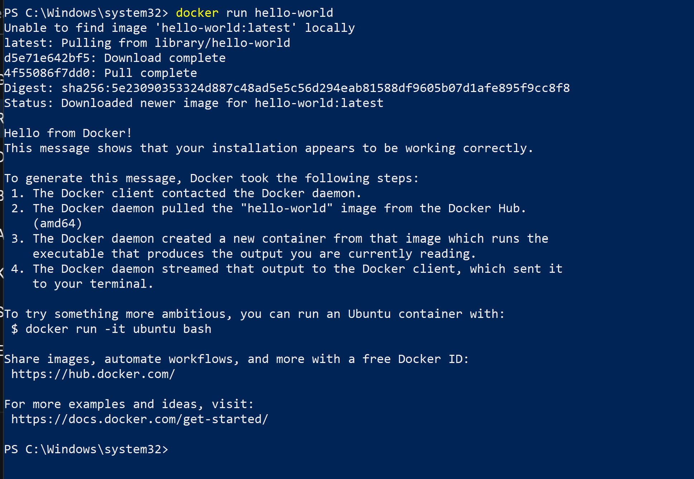

### Local CloudOps Dashboard

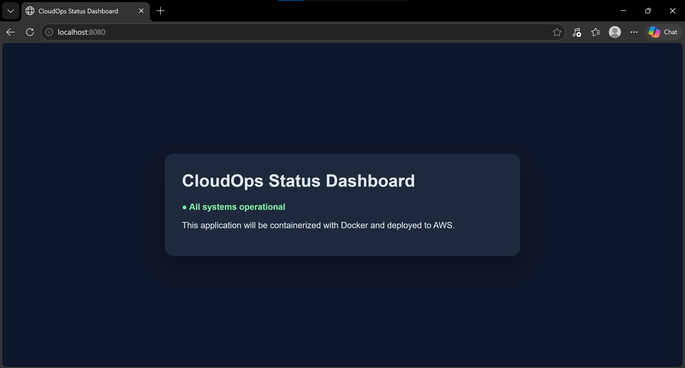

### Running Docker Container

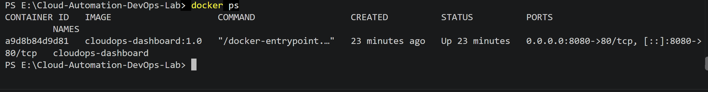

### Terraform Initialization

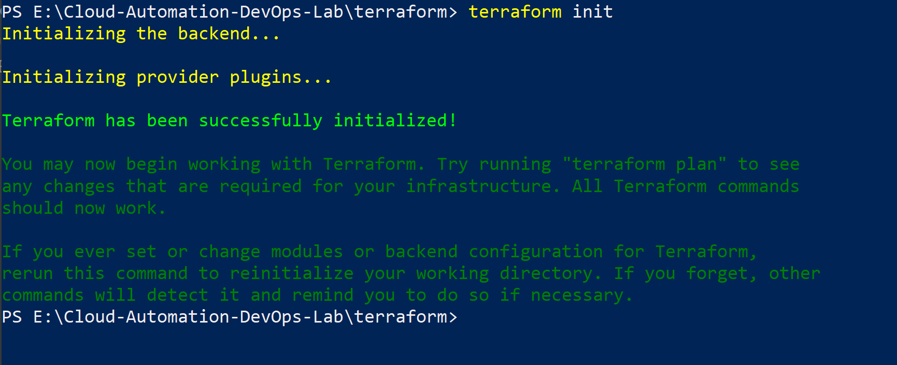

### Terraform Validation

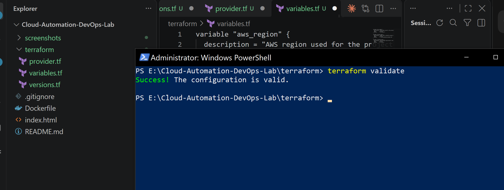

### Terraform Network Plan

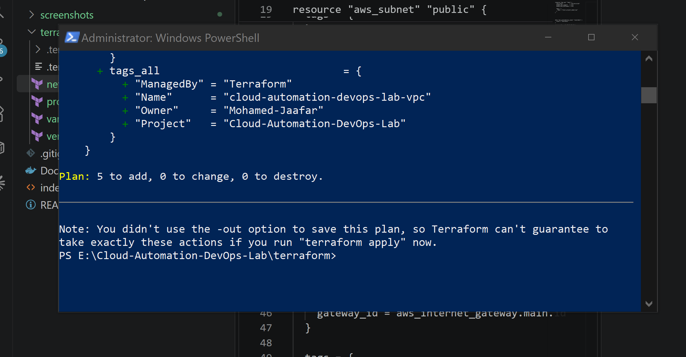

### Terraform Network Deployment

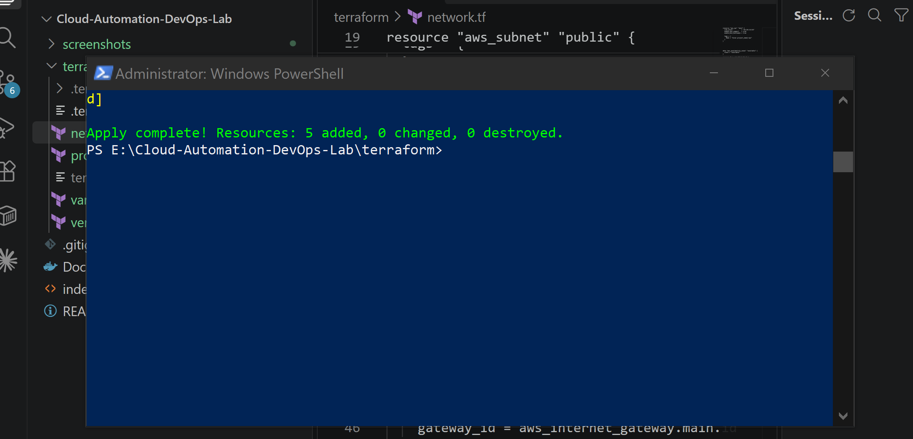

### Terraform EC2 Plan

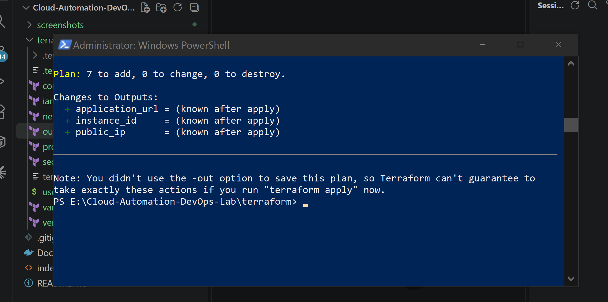

### Terraform EC2 Deployment

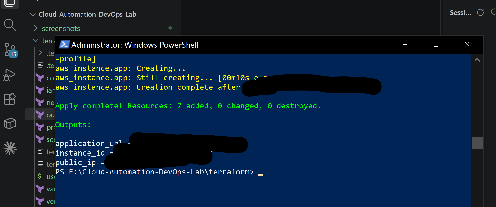

### Application Running on AWS

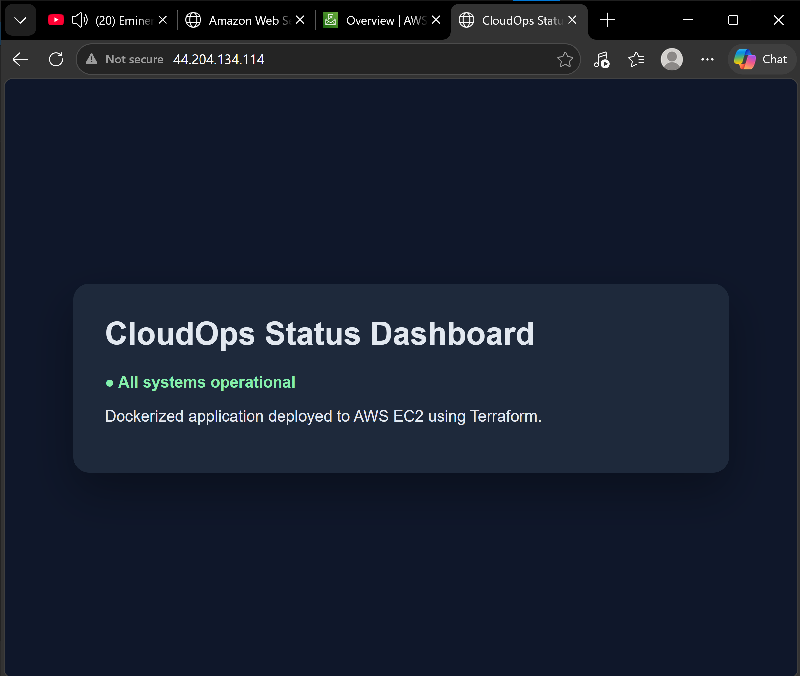

### EC2 Managed Through Systems Manager

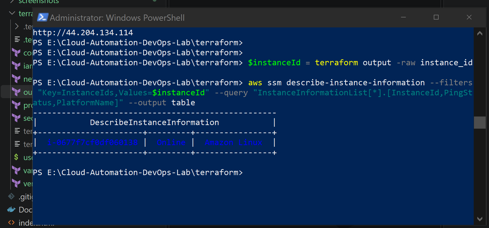

### Terraform Idempotency Check

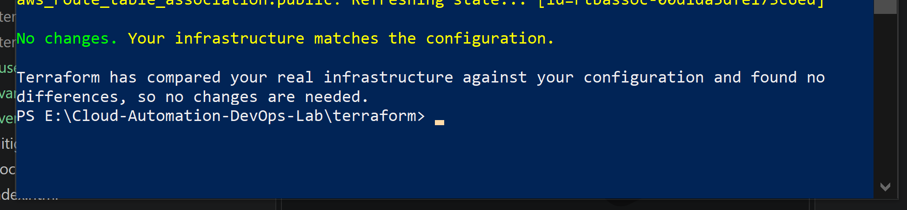

## Next Phases

- Store the Docker image in Amazon ECR.
- Create a GitHub Actions CI/CD pipeline.
- Automate application deployment to EC2.
- Add CloudWatch monitoring and alerting.
- Simulate and document deployment incidents.