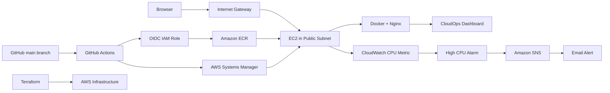

# Cloud Automation & DevOps Lab

A hands-on cloud operations project covering Docker, Terraform, AWS, CI/CD, monitoring, and incident recovery.

## Project Status

The application has been containerized, deployed to AWS, updated automatically through GitHub Actions, monitored with CloudWatch, and tested through a controlled outage and recovery.

## Architecture



## Technologies

- Docker and Nginx
- HTML and CSS
- Git and GitHub
- Terraform
- AWS VPC, EC2, IAM, ECR, Systems Manager, CloudWatch, and SNS
- GitHub Actions and OIDC

## What I Built

- Packaged the CloudOps dashboard in a Docker image and tested it locally.
- Provisioned a VPC, public subnet, routing, security group, and EC2 instance with Terraform.
- Configured an encrypted EC2 root volume, IMDSv2, and Systems Manager access without opening SSH.
- Created an ECR repository with image scanning and a lifecycle policy that keeps the five most recent images.
- Configured GitHub Actions to build the image, push it to ECR, and deploy it to EC2 through Systems Manager.
- Used GitHub OIDC and a restricted IAM role instead of long-term AWS access keys.
- Added a CloudWatch high-CPU alarm with SNS email notification.
- Simulated a container outage, diagnosed the stopped container, and restored the application.

## CI/CD Flow

1. A change to `index.html`, `Dockerfile`, or the deployment workflow is pushed to `main`, or the workflow is started manually.
2. GitHub Actions assumes the AWS IAM role through OIDC.
3. The workflow builds a Docker image and pushes commit-specific and `latest` tags to ECR.
4. Systems Manager instructs EC2 to pull the new image and replace the running container.
5. The workflow checks whether the deployment command succeeded.

Changes only to screenshots or documentation do not trigger automatic deployment.

## Run Locally

From the project root:

```bash
docker build -t cloudops-dashboard:1.0 .
docker run -d --name cloudops-dashboard -p 8080:80 cloudops-dashboard:1.0
```

Open `http://localhost:8080`.

Check or manage the container:

```bash
docker ps
docker stop cloudops-dashboard
docker start cloudops-dashboard
```

## Recreate the AWS Lab

AWS resources are destroyed when lab work ends to limit cost. To recreate them:

1. Sign in with `aws login`.
2. Create `terraform/terraform.tfvars` locally with `alert_email = "your-email@example.com"`, replacing the example address.
3. Run:

```powershell
terraform -chdir=terraform init
terraform -chdir=terraform validate
terraform -chdir=terraform plan
terraform -chdir=terraform apply
```

4. Get the new EC2 instance ID:

```powershell
terraform -chdir=terraform output -raw instance_id
```

5. Update the `EC2_INSTANCE_ID` repository variable in GitHub Actions. Run the deployment workflow manually to populate the newly created ECR repository and publish the current application image.
6. Get the application URL:

```powershell
terraform -chdir=terraform output -raw application_url
```

Confirm the SNS subscription from the email sent by AWS.

## Monitoring and Incident Response

The CloudWatch alarm watches the EC2 `CPUUtilization` metric. It enters `ALARM` when the five-minute average exceeds 70%. An SNS topic sends an email notification to the confirmed subscriber.

The notification path was tested by temporarily setting the alarm state to `ALARM`. This validated CloudWatch, SNS, and email delivery; it was a test state change, not a real high-CPU event.

A separate controlled outage tested diagnosis and recovery of a stopped Docker container. See the [container outage incident report](incidents/container-outage.md).

## Security

- No AWS access keys are stored in the repository.
- GitHub Actions uses short-lived OIDC credentials restricted to this repository and the `main` branch.
- The CI/CD role is limited to the project ECR repository and deployment through Systems Manager.
- EC2 reads images from ECR through its instance role.
- SSH is not exposed. Only HTTP port 80 is open to the public.
- EC2 requires IMDSv2 and uses an encrypted root volume.
- Terraform state and `terraform.tfvars` are excluded from Git and must be kept private.

## Cost Control and Limitations

- The lab uses one `t3.micro` EC2 instance and an 8 GB root volume.
- No NAT Gateway, load balancer, or managed database is used.
- An AWS monthly budget alert was configured separately.
- Run `terraform -chdir=terraform destroy` when the lab is not in use. This also removes the ECR repository and its images.
- This is a learning environment with one server, no failover, and HTTP rather than HTTPS.

## Evidence

- [Docker installation test](screenshots/01-docker-hello-world.png)
- [Local dashboard](screenshots/02-local-dashboard.png)
- [Terraform EC2 deployment](screenshots/10-terraform-ec2-apply.png)
- [Application on AWS](screenshots/11-aws-terraform-dashboard.png)
- [ECR image](screenshots/16-ecr-image-v1.png)
- [Successful GitHub Actions run](screenshots/20-github-actions-success.png)
- [Automatically deployed Version 2](screenshots/21-cicd-auto-deployment.png)
- [CloudWatch alarm test](screenshots/25-cloudwatch-alert-test.png)
- [Container outage](screenshots/26-container-outage.png)
- [Container stopped](screenshots/27-container-stopped-diagnosis.png)
- [Application recovered](screenshots/28-container-recovered.png)
- [Resource cleanup](screenshots/22-terraform-destroy.png)

## Project Structure

```text
.github/workflows/deploy.yml    CI/CD pipeline
terraform/                      AWS infrastructure and monitoring
incidents/container-outage.md   Incident report
screenshots/                    Test evidence
Dockerfile                      Application image definition
index.html                      CloudOps dashboard
README.md                       Project documentation
```